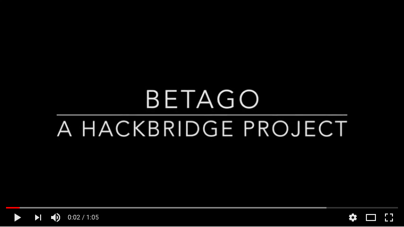

# BetaGo
A scaled down version of AlphaGo Zero, playing on a 5x5 board

# Video Demo

[](https://www.youtube.com/watch?v=FMNroKQ-srg)

## Overview

This projects aims to reimplement the [AlphaGo Zero paper](https://www.nature.com/articles/nature24270) to play on a 5x5 board.

AlphaGo Zero uses end-to-end reinforcement learning to learn Go from scratch, without any human player data.

## Project Architecture

* **GoGame**: Go simulation code.

* **MCTS**: Implmentation for Monte-carlo tree search.

* **Model**: Neural network architecture

* **Selfplay**: Module for managing the games between agents

* **Shared**: Miscellaneous functions and constants

* **Training**: Class for generating gameplay data and performing training and evaluation

## To Run

Generate games and train the model:
```python
python3 train.py
```

Test a trained model:
```python
python3 test.py
```
